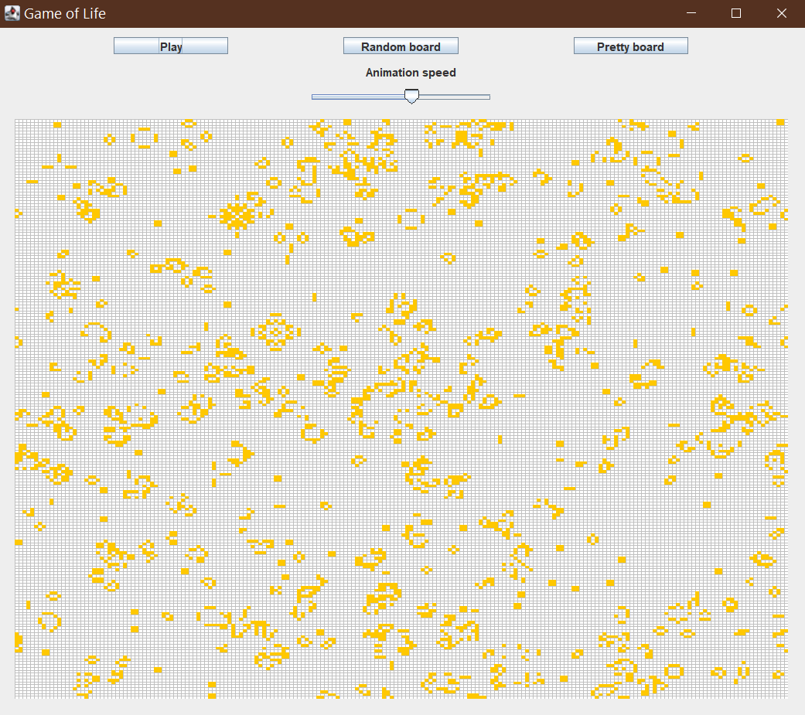

# Демонстрация виртуальных тредов


## Общая информация
Данное приложение демонстрирует нововведение Java 19: виртуальные треды.
Для примера используется визуализация клеточного автомата [игра "Жизнь"](https://ru.wikipedia.org/wiki/%D0%98%D0%B3%D1%80%D0%B0_%C2%AB%D0%96%D0%B8%D0%B7%D0%BD%D1%8C%C2%BB).
Каждая клетка запускается в отдельном виртуальном треде и контактирует с соседями с помощью класса
BlockingQueue. Синхронизация достигается за счет использования класса CyclicBarrier.


По умолчанию запускается поле 200x200 клеток, что эквивалентно 40 000 тредам, что было бы невозможно при использовании платформенных тредов
## Как использовать
Требуется Java версии 19 и выше
```sh
mvn compile
java --enable-preview -cp target/classes/ org.example.Main
```

Запуск с параметром 1 создаст меньшее поле 100x100 клеток.
<br>Запуск с параметром 2 создаст большее поле 200x500 клеток(100 000 тредов). 
